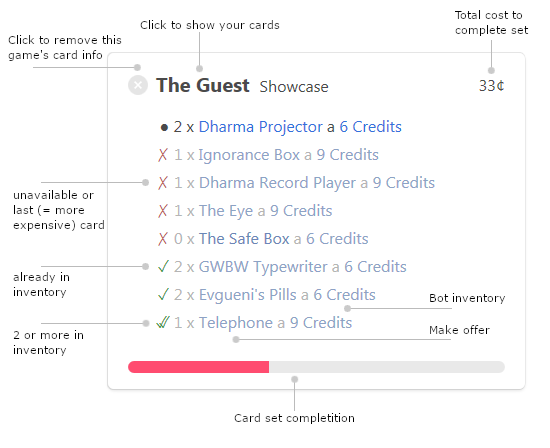

CardAvailability
================

#### About
Bioruebe's Trading Card Bot Availability Checker (BioTC) is a small console application to simplify trading Steam Trading Cards with the [SteamCardExchange bot](https://www.steamcardexchange.net/index.php?guide).

SteamCardExchange provides an online interface to check for available trading cards. Comparing your own card to the bot's inventory is a lengthy process though, which BioTC automatizes for you.

#### How it works

For every trading card in your inventory, BioTC first retrieves information about the whole card set from SteamCardExchange. Then, it searches for cards you are missing from said set and looks into the bot's inventory to compare them with the available cards. The result - a list of all missing trading cards the bot can provide - is displayed in your browser.

#### Download

Get the current prebuilt binary from the [Releases tab](https://github.com/Bioruebe/CardAvailability/releases).

Alternatively, you can simply clone the repository and run `python biotc.py`

#### Usage

Before you can use BioTC, you must tell it which Steam profile to use for comparision. To do so, simply open the file `SteamID.txt` (or create it if it doesn't exist) and paste your Steam ID.
To get your Steam ID open your Steam profile and copy the part of the URL after `https://steamcommunity.com/id/`.
Your Steam profile and inventory must be set to public, otherwise BioTC will not work.

From now on you can simply start the program and wait until your browser opens with the results of the comparison.

##### Card set overview

After processing has finished, your standard web browser will open and display an overview of available cards missing from your inventory. For each game you will see a box with all the information and links to quickly trade with the bot:

After clicking a card name to make an offer, the status is updated automatically: a green check mark is added, progress/total cost changes and the list item will become grayed out. This (along with the close icon at the top left of each box) is a temporary effect. You can reset it by reloading the page.

You can sort the boxes with the drop-down button at the top right of the page. Your sorting order will be saved locally and applied even after running biotc again or reloading the page

Note: although the program's output looks like a web page, it isn't. The overview does not update if the bot's inventory changes; you have to run biotc again if you want to know the current availability. This means the card you want to trade might already be taken by someone else, if you waited too long after running biotc - but normally that is only a problem during Steam sales.

##### Command line usage

Alternatively, you can run BioTC from the command line. Type `biotc --help` to show a list of all supported command line parameters.

Instead of having a `SteamID.txt` file, the Steam ID can be provided by adding the parameter `-n` (or `--name`).